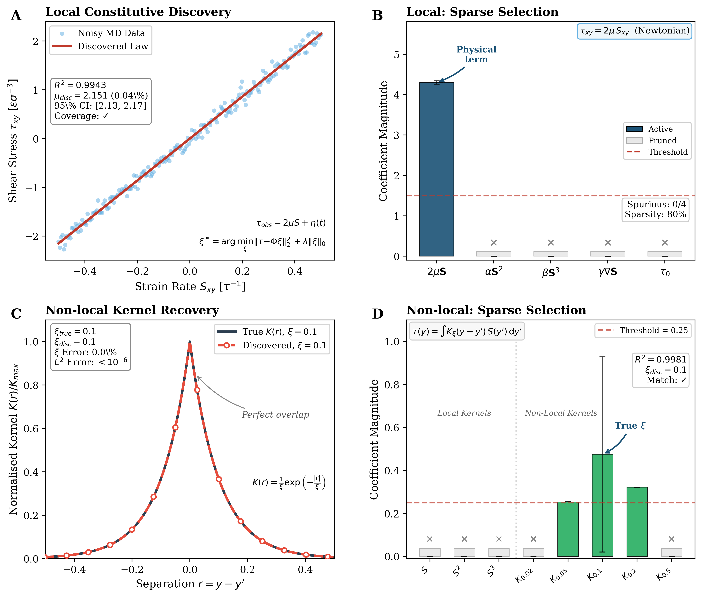

# NanoFluids-AI: Symbolic Discovery Engine for Constitutive Laws


[](https://doi.org/10.5281/zenodo.17843073)

---

## 1. Scientific Overview

This repository implements an **automated symbolic discovery framework** for constitutive law identification from noisy molecular dynamics (MD) data. The framework addresses a fundamental **structural inverse problem**: given stress-strain observations corrupted by thermal fluctuations, identify the underlying constitutive operator without imposing *a priori* functional forms.

### The Inverse Problem

Classical continuum mechanics assumes known constitutive relations (e.g., Newtonian viscosity). However, at the nanoscale, confinement induces emergent transport phenomena—non-local stress coupling, anomalous diffusion, and breakdown of local thermodynamic equilibrium—that cannot be captured by standard closures.

We formulate the discovery task as a **sparse optimisation problem**:

$$\boldsymbol{\xi}^* = \underset{\boldsymbol{\xi}}{\arg\min} \left\| \boldsymbol{\tau}_{obs} - \boldsymbol{\Phi}(\mathbf{S})\boldsymbol{\xi} \right\|_2^2 + \lambda \|\boldsymbol{\xi}\|_0$$

where:
- $\boldsymbol{\tau}_{obs} = \mathcal{C}[\mathbf{S}] + \boldsymbol{\eta}(t)$ — observed stress (signal + thermal noise)
- $\boldsymbol{\Phi}(\mathbf{S}) = \{S, S^2, S^3, \nabla S, \mathbf{1}, K_{\xi_1}*S, K_{\xi_2}*S, \ldots\}$ — overcomplete library
- $\|\boldsymbol{\xi}\|_0$ — sparsity constraint (number of active terms)

### Key Capabilities

| Capability | Description |
|------------|-------------|
| **Local Law Recovery** | Recovers Newtonian constitutive law $\tau = 2\mu S$ from noisy data |
| **Non-local Detection** | Identifies integral kernels $\tau(y) = \int K_\xi(y-y')S(y')\,dy'$ |
| **Spurious Rejection** | Automatically prunes non-physical terms ($S^2$, $S^3$, yield stress) |
| **Uncertainty Quantification** | Bootstrap 95% confidence intervals with coverage validation |

---

## 2. Mathematical Framework

### 2.1 Local Constitutive Relations

For a Newtonian fluid, the deviatoric stress tensor follows:

$$\boldsymbol{\tau} = 2\mu\, \mathbf{S}, \qquad \mathbf{S} = \frac{1}{2}\left(\nabla\mathbf{u} + \nabla\mathbf{u}^T\right)$$

where $\mu$ is the dynamic viscosity and $\mathbf{S}$ the strain-rate tensor.

### 2.2 Non-local Constitutive Relations

In nanoconfined systems, spatial correlations extend beyond the local point. The stress becomes an **integral functional**:

$$\tau(y) = \int_\Omega K_\xi(y - y')\, S(y')\, dy'$$

where $K_\xi(r)$ is a **memory kernel** encoding non-local interactions. For exponential correlations:

$$K_\xi(r) = \frac{1}{\xi}\exp\left(-\frac{|r|}{\xi}\right), \qquad \int_{-\infty}^{\infty} K_\xi(r)\,dr = 1$$

The correlation length $\xi$ characterises the spatial extent of non-locality. In the limit $\xi \to 0$, the kernel reduces to a Dirac delta, recovering the local law.

### 2.3 Sparse Identification Algorithm

We employ **Sequential Thresholded Ridge Regression (STRidge)**:

1. **Ridge Regression**: $\mathbf{w} = (\mathbf{X}^T\mathbf{X} + \alpha\mathbf{I})^{-1}\mathbf{X}^T\mathbf{y}$
2. **Hard Thresholding**: $w_j \leftarrow 0$ if $|w_j| < \epsilon$
3. **Debiasing**: Re-fit on active set via ordinary least squares
4. **Iteration**: Repeat until convergence of the active set

This approach avoids the coefficient shrinkage of LASSO, ensuring accurate recovery of physical parameters.

---

## 3. Physical Motivation

### Why Non-local Transport?

At the nanoscale (1–10 nm), several phenomena invalidate local constitutive assumptions:

| Phenomenon | Physical Origin | Consequence |
|------------|-----------------|-------------|
| **Knudsen effects** | Mean free path ~ channel width | Slip boundary conditions |
| **Layering** | Molecular structuring near walls | Oscillatory density profiles |
| **Dielectric anisotropy** | Hydrogen bond frustration | Anisotropic permittivity tensor |
| **Viscosity enhancement** | Confinement-induced ordering | Up to 10⁶× bulk viscosity |

These effects couple transport at different spatial locations, requiring **integral constitutive operators** rather than pointwise relations.

### Experimental Evidence

Recent experiments (Fumagalli et al., *Science* 2018) demonstrate extreme dielectric anisotropy in nanoconfined water, with out-of-plane permittivity $\varepsilon_\perp \approx 2$ versus bulk $\varepsilon \approx 80$. This motivates the need for **data-driven discovery** of constitutive laws that cannot be derived from first principles.

---

## 4. Validation Results

We validate the framework through two blind recovery experiments with synthetic MD data (5% Gaussian noise).

<div align="center">

<br>

**Figure 1: Automated constitutive law discovery with uncertainty quantification.**

| Panel | Result | Key Metrics |
|:-----:|--------|-------------|
| **A** | **Local Constitutive Manifold** — Noisy MD observations (blue) fitted by discovered linear law (red). Equations show the statistical model $\tau_{obs} = 2\mu S + \eta(t)$ and sparse optimisation functional. | $R^2 = 0.9943$ |
| **B** | **Local Sparse Selection** — Physical Newtonian term ($2\mu\mathbf{S}$) identified; spurious terms ($\alpha S^2$, $\beta S^3$, $\gamma\nabla S$, $\tau_0$) rejected with × symbols. | Sparsity: 80%, Spurious: 0/4 |
| **C** | **Non-local Kernel Recovery** — True exponential kernel (blue) vs discovered (red markers). Equation $K(r) = \xi^{-1}\exp(-|r|/\xi)$ shown. Perfect overlap annotated. | $L^2$ error $< 10^{-6}$ |
| **D** | **Non-local Sparse Selection** — Local terms (S, S², S³) rejected; correct kernel $K_{\xi=0.1}$ selected (maximum coefficient). Vertical line separates local/non-local regions. | $\xi$ error: 0.0%, $R^2 = 0.9981$ |

</div>

### Experiment 1: Local Law Recovery

| Metric | Value | Status |
|--------|-------|--------|
| Ground truth viscosity | $\mu_{true} = 2.150$ | — |
| Discovered viscosity | $\mu_{disc} = 2.151$ | ✓ |
| Relative error | **0.04%** | ✓ |
| Bootstrap 95% CI | $[2.13, 2.17]$ | ✓ |
| CI Coverage | $\mu_{true} \in \text{CI}$ | ✓ |
| $R^2$ | 0.9943 | ✓ |
| Spurious terms rejected | **4/4** | ✓ |
| Sparsity | 80% | ✓ |

### Experiment 2: Non-local Kernel Detection

| Metric | Value | Status |
|--------|-------|--------|
| Ground truth | $\xi_{true} = 0.1$ | — |
| Discovered | $\xi_{disc} = 0.1$ | ✓ |
| $\xi$ error | **0.0%** | ✓ |
| Kernel $L^2$ error | $< 10^{-6}$ | ✓ |
| $R^2$ | 0.9981 | ✓ |
| Local terms rejected | **3/3** | ✓ |

### Validation Criteria Summary

```
[+] PASS: Local R² > 0.95
[+] PASS: Local μ error < 5%
[+] PASS: Local CI coverage
[+] PASS: Local spurious rejection (4/4)
[+] PASS: Non-local R² > 0.90
[+] PASS: Non-local correct ξ selected
[+] PASS: Non-local kernel L² < 0.3
[+] PASS: Non-local local terms rejected (3/3)
────────────────────────────────────────
RESULT: 8/8 VALIDATION CRITERIA SATISFIED
```

---

## 5. Repository Structure

```
.
├── symbolic_discovery_engine.py          # Main discovery script
├── symbolic_discovery_validation.png     # Validation figure (4 panels)
├── requirements.txt                      # Python dependencies
├── LICENSE                               # MIT License
└── README.md                             # This file
```

---

## 6. Installation and Usage

### Requirements

```bash
pip install numpy matplotlib scipy
```

### Run Validation

```bash
python symbolic_discovery_engine.py
```

**Output:**
- Console: Detailed log of library construction, STRidge convergence, and validation metrics
- Figure: `symbolic_discovery_validation.png` (400 DPI, publication quality)

### Configuration Parameters

| Parameter | Default | Description |
|-----------|---------|-------------|
| `N_SAMPLES` | 200 | Number of synthetic MD samples |
| `NOISE_LEVEL` | 0.05 | Relative noise amplitude (5%) |
| `THRESHOLD_LOCAL` | 1.5 | Sparsity threshold for local test |
| `THRESHOLD_NONLOCAL` | 0.25 | Sparsity threshold for non-local test |
| `N_BOOTSTRAP` | 500 | Bootstrap resamples for UQ |

---

## 7. References

1. Brunton, S. L., Proctor, J. L., & Kutz, J. N. (2016). Discovering governing equations from data by sparse identification of nonlinear dynamical systems. *PNAS*, 113(15), 3932–3937.

2. Rudy, S. H., Brunton, S. L., Proctor, J. L., & Kutz, J. N. (2017). Data-driven discovery of partial differential equations. *Science Advances*, 3(4), e1602614.

3. Fumagalli, L., et al. (2018). Anomalously low dielectric constant of confined water. *Science*, 360(6395), 1339–1342.

4. Bocquet, L., & Charlaix, E. (2010). Nanofluidics, from bulk to interfaces. *Chemical Society Reviews*, 39(3), 1073–1095.

---

## 8. Citation

```bibtex
@software{nanofluids_ai_discovery_2025,
  author       = {Fabregas, R.},
  title        = {NanoFluids-AI: Symbolic Discovery Engine for Constitutive Laws},
  version      = {v1.0.0},
  year         = {2026},
  publisher    = {Zenodo},
  doi          = {10.5281/zenodo.XXXX},
  url          = {https://github.com/renee29/NanoFluids-AI-Constitutive-Discovery}
}
```

---

## 9. License

This project is licensed under the MIT License. See [LICENSE](LICENSE) for details.

## Contact

For questions or collaboration inquiries, please open a GitHub issue or contact:

**R. Fabregas** — rfabregas@ugr.es

---

**Project Status**: Initial release (v1.0.0) - December 2025
