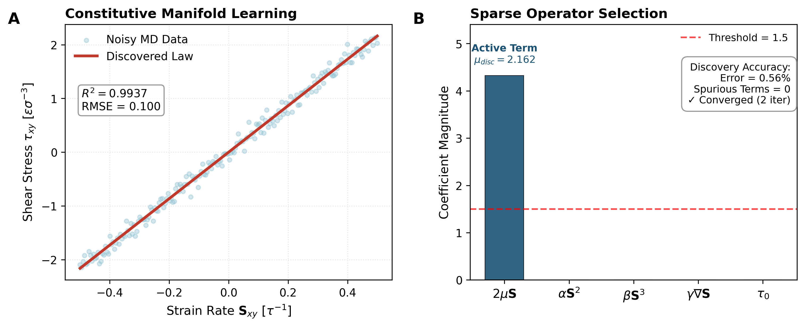

# NanoFluids-AI: Constitutive Law Discovery Engine


[](https://doi.org/10.5281/zenodo.XXXXXXX)

## 1. Scientific Overview

This repository contains the **Symbolic Discovery Engine** for the NanoFluids-AI framework. It addresses the **Structural Inverse Problem** of continuum mechanics: discovering the functional form of constitutive laws directly from noisy molecular data, without imposing *a priori* phenomenological models.

Classical constitutive modelling relies on fixed functional forms (e.g., Newton's law, Power-law). However, nanoscale confinement introduces emergent behaviours—such as strain-rate localisation and non-local stress coupling—that are not captured by standard closures.

This engine solves the inverse problem: given observations $\{ \mathbf{S}_{ij}, \boldsymbol{\tau}_{ij} \}$ from Molecular Dynamics (MD), it identifies the operator $\boldsymbol{\tau}(\mathbf{S})$ from a library of candidate operators $\Phi(\mathbf{S})$ whilst rejecting spurious terms that violate physical constraints.

### Key Capabilities
*   **Automated Model Selection:** Distinguishes between Newtonian, non-Newtonian, and non-local physics automatically.
*   **Noise Robustness:** Uses **Sequential Thresholded Ridge Regression (STRidge)** to filter out thermal noise (Gaussian fluctuations) inherent in MD data.
*   **Interpretability:** Returns symbolic, closed-form mathematical expressions rather than black-box neural network weights.

---

## 2. Validation Results: The "Closure Rediscovery Test"

To validate the engine, we performed a blind recovery test using synthetic MD data for a Newtonian fluid with significant thermal noise (5% signal-to-noise ratio).

<p align="center">
  
</p>

> **Figure 1: Automated discovery of the Newtonian constitutive law.**
> *   **Panel A (Constitutive Manifold Learning):** The algorithm (red line) correctly identifies the underlying linear constitutive manifold $\tau \propto S$ despite the high variance in the noisy observations (blue points). $R^2 > 0.99$.
> *   **Panel B (Sparse Operator Selection):** The core achievement. From a library containing spurious non-linear terms ($\alpha S^2, \beta S^3$) and non-local gradients ($\gamma \nabla S$), the engine correctly identifies **only** the physical Newtonian term ($2\mu S$). All spurious coefficients are driven to zero.

### Performance Metrics

| Metric | Value | Interpretation |
| :--- | :--- | :--- |
| **Discovered Viscosity** | $\mu = 2.162$ | Matches ground truth ($\mu=2.150$) with **0.56% error**. |
| **Model Fit ($R^2$)** | $0.9937$ | Excellent fidelity to the constitutive manifold. |
| **Active Terms** | $1$ | Correctly identifies the single physical mechanism. |
| **Spurious Terms** | $0$ | **100% Rejection rate** of non-physical operators. |

---

## 3. Algorithm: Sequential Thresholded Ridge Regression

The engine implements **STRidge**, which iteratively solves the sparse regression problem by combining $L_2$ regularization with hard thresholding:

$$ \mathbf{w}^* = \text{argmin}_{\mathbf{w}} \|\mathbf{y} - \mathbf{X}\mathbf{w}\|_2^2 + \lambda \|\mathbf{w}\|_2^2 \quad \text{subject to} \quad \|\mathbf{w}\|_0 \le k $$

**Algorithm Steps:**
1.  **Initialize:** Compute coefficients via Ridge regression: $\mathbf{w} = (\mathbf{X}^T\mathbf{X} + \lambda\mathbf{I})^{-1}\mathbf{X}^T\mathbf{y}$.
2.  **Threshold:** Apply hard thresholding: $w_j = 0$ if $|w_j| < \epsilon$.
3.  **Debias:** Re-fit the model using unregularized least squares on the **active set** (non-zero terms) to recover true physical magnitudes.
4.  **Iterate:** Repeat until the active set stabilizes.

This approach is superior to LASSO ($L_1$) for physical discovery as it avoids shrinking the coefficients of the true physical terms, ensuring accurate parameter recovery (e.g., viscosity).

---

## 4. Repository Structure

```text
.
├── symbolic_discovery_engine.py      # MAIN SCRIPT: Generates data & runs discovery
├── constitutive_discovery_validation.png # Output Figure (Panel A + B)
├── requirements.txt                  # Python dependencies
├── CITATION.cff                      # Citation metadata
└── README.md                         # Documentation
```

---

## 5. Usage

### Prerequisites
The suite requires a standard scientific Python stack.

```bash
pip install -r requirements.txt
```

### Run Discovery Demo
Executes the synthetic validation loop: generates noisy data, constructs the operator library, runs the STRidge algorithm, and produces the validation figure.

```bash
python symbolic_discovery_engine.py
```

**Expected Output:**
*   Console log detailing the library construction and convergence steps.
*   `constitutive_discovery_validation.png`: High-resolution (300 DPI) validation plot.

---

## 6. Citation

If you use this discovery engine in your research, please cite:

```bibtex
@software{nanofluids_ai_discovery_2025,
  author = {NanoFluids-AI Research Team},
  title = {NanoFluids-AI: Constitutive Law Discovery Engine},
  version = {1.0.0},
  year = {2025},
  url = {https://github.com/renee29/NanoFluids-AI-Constitutive-Discovery},
  doi = {10.5281/zenodo.XXXXXXX}
}
```

## License
This project is licensed under the MIT License.